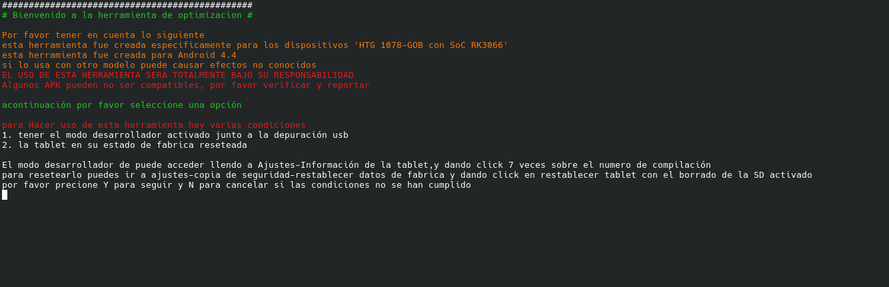
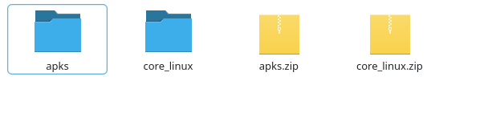
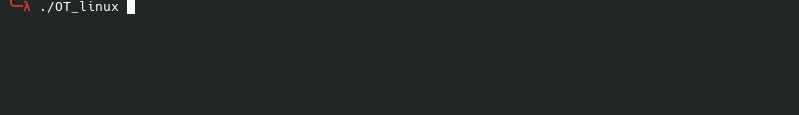

# OT

Este proyecto nacío por la necesidad de alargar la vida util de las tablets "HTG 1078-GOB" con android 4.4

**Automatizando la optimización de estas tablets**

## 🛠️ Tecnologías usadas

Este proyecto tiene como motor las siguientes tecnologías 

1. Golang
2. ADB
---
## 📦 Instalación

para usar este OS en las distintas plataformas damos las siguientes Instrucciones

 1. descargar el core para tu OS (o el core completo)
 2. descargar el conjunto de APK
 3. descomprimir ambos archivos
 4. copiar/mover todos los apks a la carpeta apks dentro de el core 
 5. modificar el install.txt y el uninstall.txt en caso de ser nesesario

 

---
## 🚀 Uso

1. Abrir la carpeta del core en consola
2. Ejecutar el archivo correspondiente (si tiene fallos usar sudo/admin)

+ Linux
`./OT_linux `
+ Windows
`./OT_windows.exe `
+ MacOS
`./OT_mac_intel `

3. Formatear la tablet

para formatear la tablet siga los siguientes pasos

`Configuración -> copia de Seguridad -> Restablecer datos de fábricaa  -> Restablecer tablet`

4. Activar depuración USB

para activar la depuración USB siga los siguientes pasos

`Configuración -> información de la tablet -> (presionar 7 veces Número de compilación) -> Opciones de desarrollo -> Activar depuración USB`

5. Presionar "Y"
6. Selecciónar el Dispositivo
7. Esperar a que termine el Proceso 

---
## 📂Modificando

El ejecutable requiere de 2 archivos install.txt y uninstall.txt

### Install.txt -> contiene las aplicaciones que se instalaran

`name true I` -> se instalara

`name2 false I` -> no se instalara

**El nombre debe ir sin APK**

### Uninstall.txt -> contiene las aplicaciones y servicios que se Desistalaran o se desactivaran

`name true D` -> se desactivara

`name2 true U` -> se desinstalarán

---
## ⚠️ Notas
*Para maxima eficiencia se recomienda descargar la version core (completa) y portarla en una memoria USB*

para usar esta herramienta se recomienda abrirlo desde una CLI para mejor funcionamiento

**puede nesesitar permisos de admin/sudo dependiendo el OS**

**los apks son autoria de sus respectivos autores**

**PUBLICADA BAJO LA LICENCIA MIT**